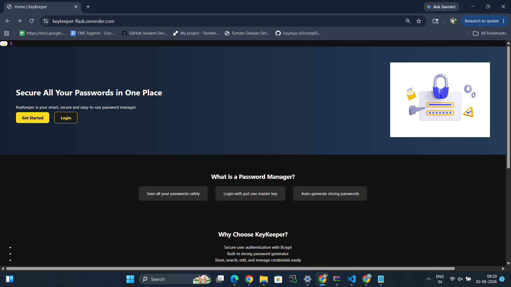
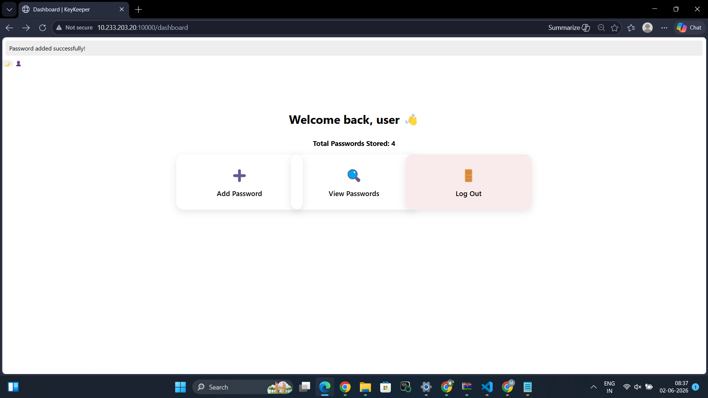
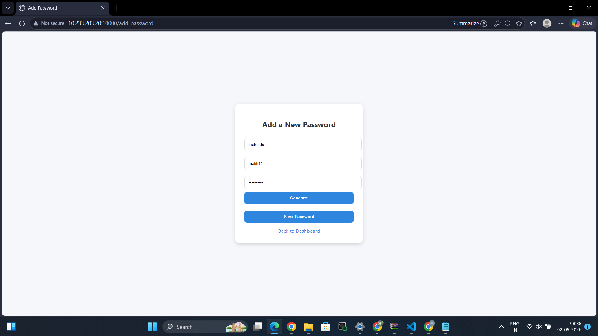
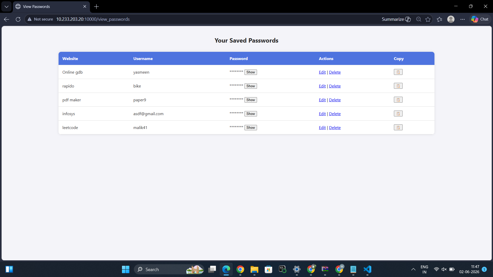

# 🔐 KeyKeeper

A secure password management web application built with Flask and SQLAlchemy.

KeyKeeper allows users to generate, store, manage, and organize credentials through a simple and responsive web interface. The project focuses on authentication, password management, and security fundamentals while providing a clean user experience.

## 🌐 Live Demo

https://keykeeper-flask.onrender.com

> Hosted on Render's free tier. Initial loading may take a few seconds if the service is waking up from inactivity.

---

## ✨ Features

* Secure user registration and login using Bcrypt password hashing
* Personal password vault with add, edit, delete, view, and copy functionality
* Built-in random password generator
* Dashboard displaying saved credential statistics
* Dark mode support
* Responsive and user-friendly interface

---

## 📸 Screenshots

### Home Page



### Dashboard



### Add Password



### Password Vault



---

## 🛠️ Tech Stack

| Category       | Technologies                  |
| -------------- | ----------------------------- |
| Backend        | Python, Flask                 |
| Database       | SQLite, SQLAlchemy            |
| Authentication | Flask-Login, Flask-Bcrypt     |
| Frontend       | HTML, CSS, JavaScript, Jinja2 |
| Deployment     | Render                        |

---

## 📂 Project Structure

RTRP/
│
├── app.py
├── requirements.txt
├── README.md
│
├── static/
│   ├── style/
│   └── images/
│
├── templates/
│
└── screenshots/

## ⚙️ Local Setup

Clone the repository:

```bash
git clone https://github.com/yasmeenm9/keykeeper-flask.git
cd keykeeper-flask
```

Create and activate a virtual environment:

```bash
python -m venv venv
venv\Scripts\activate
```

Install dependencies:

```bash
pip install -r requirements.txt
```

Run the application:

```bash
python app.py
```

The application will be available at:

http://127.0.0.1:10000


---

## 🔒 Security Highlights

* Password hashing using Bcrypt
* Session-based authentication
* User-specific credential storage
* Protected application routes

---

## 🚀 Future Enhancements

* Fernet encryption for stored credentials
* QR-based authentication
* Multi-factor authentication (MFA)

---

## 👩‍💻 Developer

**Mohammed Yasmeen**

Developed as a full-stack Flask project to explore authentication systems, credential management, and web security concepts.

---
